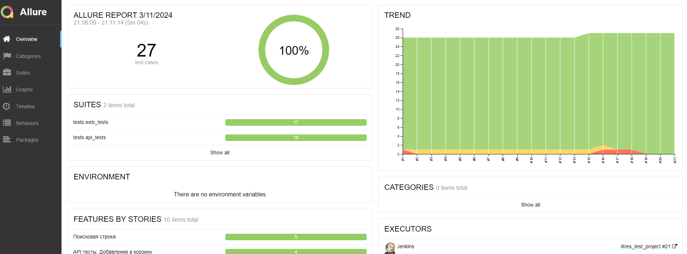
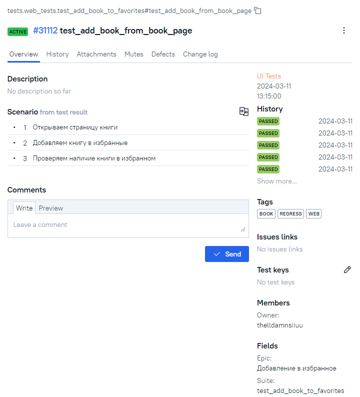

<h1> Проект по тестированию сервиса электронных и аудиокниг "Литрес"</h1>

> <a target="_blank" href="https://www.litres.ru">Ссылка на сайт</a>


<h3> Список проверок, реализованных в автотестах:</h3>

### UI-тесты
- [x] Авторизация пользователя на сайте(успешная и неуспешная)
- [x] Поиск книги
- [x] Добавление книги в корзину
- [x] Удаление книги из корзины
- [x] Добавление книги в Избранное
- [x] Удаление книги из Избранного

### API-тесты
- [x] Авторизация пользователя на сайте(успешная и неуспешная)
- [x] Поиск книги
- [x] Добавление книги в корзину
- [x] Добавление книги в избранные
- [x] Удаление книги из корзины


----
### Проект реализован с использованием:
         

----
### Локальный запуск
> Для локального запуска с дефолтными значениями необходимо выполнить команду:
```
python -m venv .venv
source .venv/bin/activate
pip install -r requirements.txt
pytest tests
```

----
### Удаленный запуск автотестов выполняется на сервере Jenkins
> <a target="_blank" href="https://jenkins.autotests.cloud/job/litres_test_project/">Ссылка на проект в Jenkins</a>


#### Для запуска автотестов в Jenkins

1. Открыть <a target="_blank" href="https://jenkins.autotests.cloud/job/litres_test_project/">проект</a>
2. Выбрать пункт `Build Now`
3. Результат запуска сборки можно посмотреть в отчёте Allure

----
### Allure отчет


#### Общие результаты


#### Список тест кейсов


#### Пример отчета о прохождении ui-теста


#### Пример отчета о прохождении api-теста


----
### Полная статистика по прохождению тестпланов, отчёты и приложения к ним хранятся в Allure TestOps
> <a target="_blank" href="https://allure.autotests.cloud/project/4129/dashboards">Ссылка на проект в AllureTestOps</a> (запрос доступа `admin@qa.guru`)

#### Тест-планы проекта


#### Общий список всех кейсов, имеющихся в системе (без разделения по тест-планам и виду выполнения тестирования)


#### Пример отчёта выполнения одного из автотестов



#### Тестовые артефакты


#### Пример dashboard с общими результатами тестирования


#### История запуска тестовых наборов


----
### Интеграция с Jira
> <a target="_blank" href="https://jira.autotests.cloud/browse/HOMEWORK-1164">Ссылка на проект в Jira</a>


----
### Оповещение о результатах прогона тестов в Telegram


----
### Пример видео прохождения ui-автотеста


